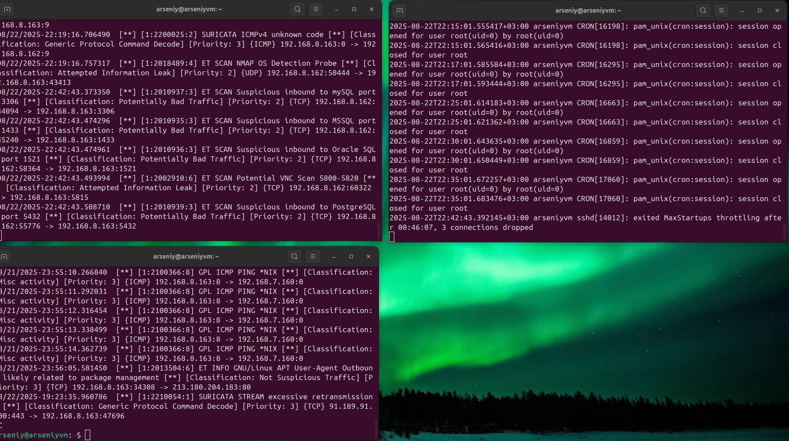
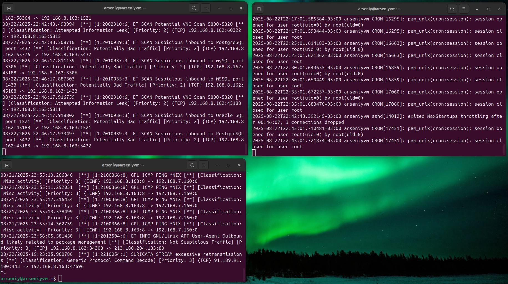

# Домашнее задание к занятию   
**"`Защита сети`"** - `Воскобойников Арсений Петрович`  
   
**Задание 1**  
``` 
Проведите разведку системы и определите, какие сетевые службы запущены на защищаемой системе:

sudo nmap -sA < ip-адрес >

sudo nmap -sT < ip-адрес >

sudo nmap -sS < ip-адрес >

sudo nmap -sV < ip-адрес >

По желанию можете поэкспериментировать с опциями: https://nmap.org/man/ru/man-briefoptions.html.

В качестве ответа пришлите события, которые попали в логи Suricata и Fail2Ban, прокомментируйте результат.
``` 

**Ответ**  
на всех экранах отображаются:
левый верхний - лог suricata
левый нижний - лог suricata
правый верхний - лог fail2ban

Выполним sudo nmap -sA < 192.168.8.163 > # Suricata отмечает "необычные ACK пакеты без установленных соединений"


Лог Suricata фиксирует необычные ACK пакеты без установленых соединений.
Лог Failban пустой так как не попыток авторизации.

Выполним sudo nmap -sT < 192.168.8.163 > # TCP Connect scan - полный коннект



Лог Suricata фиксирует реальные установленные соединения.
Лог Failban пустой так как не попыток авторизации.

Выполним sudo nmap -sS < 192.168.8.163 >  # фиксируются SYN пакеты без завершения TCP



Лог Suricata фиксирует зафиксируются SYN пакеты без завершения TCP..
Лог Failban зафиксировал попытки авторизации

Выполним sudo nmap -sV < 192.168.8.163 >  # заметны повторные TCP-запросы 


Лог Suricata фиксирует заметны повторные TCP-запросы.
Лог Failban зафиксировал попытки авторизации.

В связке:

Suricata показывает факт разведки.

Fail2Ban включится только при агрессивных атаках

**Задание 2**   

```
Проведите атаку на подбор пароля для службы SSH:

hydra -L users.txt -P pass.txt < ip-адрес > ssh

Настройка hydra:
создайте два файла: users.txt и pass.txt;
в каждой строчке первого файла должны быть имена пользователей, второго — пароли. В нашем случае это могут быть случайные строки, но ради эксперимента можете добавить имя и пароль существующего пользователя.
Дополнительная информация по hydra: https://kali.tools/?p=1847.

Включение защиты SSH для Fail2Ban:
открыть файл /etc/fail2ban/jail.conf,
найти секцию ssh,
установить enabled в true.
Дополнительная информация по Fail2Ban:https://putty.org.ru/articles/fail2ban-ssh.html.

В качестве ответа пришлите события, которые попали в логи Suricata и Fail2Ban, прокомментируйте результат.
``` 
**Ответ**    
Запустим Hydra с файлаи паролей и пользователей


Лог Suricata фиксирует заметны повторные TCP-запросы.
Лог Failban зафиксировал активные попытки авторизации.
